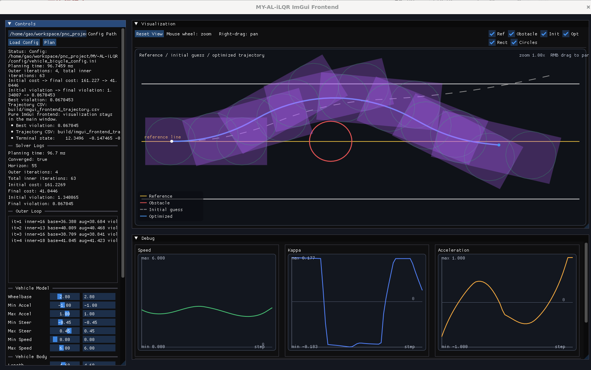
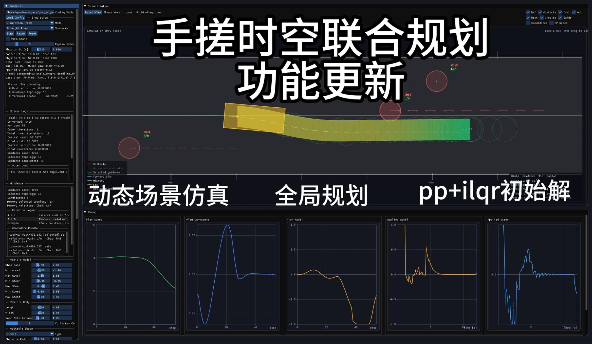
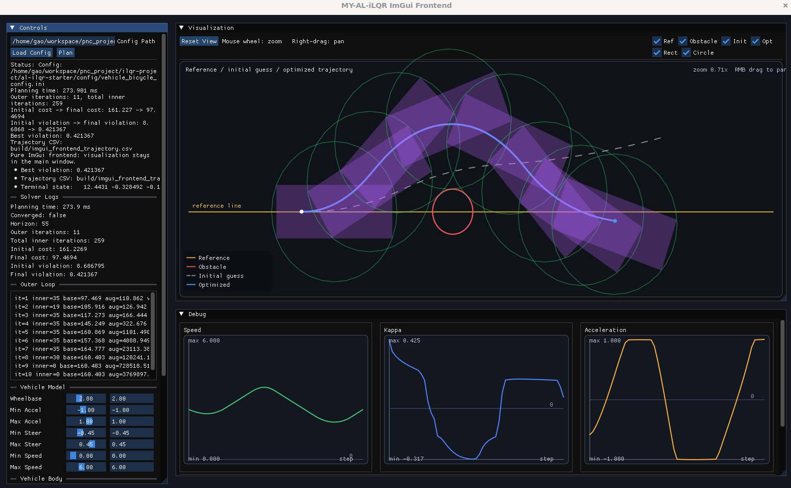

# AL-iLQR Starter

> 🌐 [中文](#中文版) | [English](#english-version)

---

## 中文版

一个面向教学的 **AL-iLQR（Augmented Lagrangian iLQR）** 轨迹优化入门项目。

本仓库聚焦 **AL-iLQR 算法**，帮助读者从零理解：

- 离散时间最优控制问题如何建模
- 无约束 iLQR 如何工作
- 增广拉格朗日如何处理约束
- AL-iLQR 外层 / iLQR 内层如何协同求解
- 如何把论文中的求解流程落到可运行代码

> 仓库分为starter版本和Pro版本。
> 
> 当前仓库为starter版本，包含了完整的al-ilqr求解器和基础应用，代码基本不再迭代
> 
> Pro版本为持续更新版，会持续修复bug，持续工程优化，有配套开发指南

### Pro版本更新日志

#### 2026.03.19

初始版本发布

#### 2026. 03.20

---

### 文档说明

安装依赖、编译和运行方式，请查看 [`quick_start.md`](quick_start.md)。

---

### Starter 版本包含什么

Starter 版本保留了 AL-iLQR 的核心主线，主要包括：

- 离散最优控制问题建模
- 前向 rollout
- 有限时域 LQR
- 无约束 iLQR
- 数值差分的局部展开
- backward pass / forward pass
- 正则化与线搜索
- 增广拉格朗日外层循环
- 基础约束优化示例

如果你的目标是先把「AL-iLQR 到底是怎么工作的」这件事搞明白，这个版本已经足够作为一个清晰的起点。

---

### Starter 版本没有包含什么

当前 Starter 版本未包含：

- 车体多圆拟合
- 多圆车体-障碍物碰撞约束
- 车道线边界约束
- 更完整的自动驾驶场景模块
- 完整版工程化教程与扩展说明

因此**当前仓库**轨迹优化结果如下图：

这个版本更适合你学习求解器主线、约束优化基本思想、AL-iLQR 的代码结构，而不是直接把它当成一个更完整的自动驾驶规划工程。

---

掌握一份代码很简单，最宝贵的是，优化这个工程的经验，修复bug的经验，比如：

- 如何进行更精确的碰撞检测
- 多圆如何拟合车体
- 车道线边界约束如何添加
- 如何提升数值稳定性
- 如何降低耗时
- 论文和代码如何对齐
- 以及更多的工程技巧
- bug修复经验
- ......

### 进阶学习

当前仓库代码是完整的，我们称为starter版本，包含完整的al-ilqr求解器，如果你想进阶学习，可以获取Pro版本。

Pro 版本面向希望进一步深入的学习者和工程开发者，让你学会如何将一个al-ilqr求解器，一步一步添加约束，应用到特定的场景如自动驾驶，移动机器人等。
#### 已完成功能
- 更完整的源码 （已完成）
  - 车体多圆拟合
  - 多圆车体-障碍物碰撞约束
  - 车道线边界约束
  - 更完整的自动驾驶场景模块
- 更完整的教程与文档 （已完成）
- 更系统的论文步骤对照说明 （已完成）

#### 未来定期升级更新功能

| 更新的主题 | 说明 |
|------|------|
| 解析 Jacobian | 替代数值差分，提升精度和效率 |
| 更复杂的动力学 | 动力学自行车模型 |
| 曲线参考线 | 处理弯道、交叉口 |
| 多障碍物 | 多个静态/动态障碍物的混合场景 |
| 实时求解 | 热启动 + 缩短时域 |
| MPC 框架 | 滚动时域在线规划 |
| 自动微分 | 替代数值差分，精确且高效 |

#### Pro版本获取方式

采取文章付费，Pro版本代码免费持续更新的方式。

1. 购买指定的公众号付费文章《**进阶专用：al-ilqr如何落地到具体场景**》(一次性付费即可，包含后续所有文章)。
2. 将您的github用户名发送给我(公众号私信或添加微信发送都行)
3. 我会给您添加github仓库权限。
4. 详细的开发指南，会在仓库里陆续更新，也会在个人博客上更新(完成步骤1可获得阅读权限)

**微信号**：ahrs365

**微信公众号**：

  

**交流群**

  

**博客：** [gl-robotics](https://www.gl-robotics.com/)

---

### License

本 Starter 仓库采用 [MIT License](LICENSE)。

> 注意：Pro 版本采用自定义授权协议，不适用 MIT。

---

### 支持项目

如果这个仓库对你有帮助，欢迎：

- 点一个 ⭐ Star
- 分享给对轨迹优化感兴趣的朋友
- 查看 Pro 版本以获取完整实现与教程

